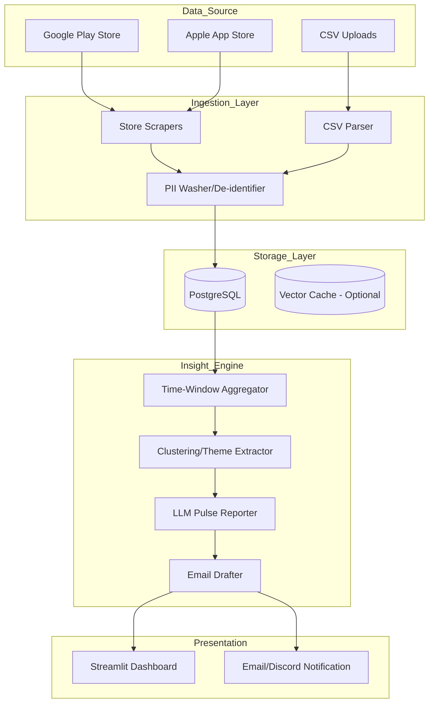

# GROWW App Review Insights Analyser: Architecture Plan

## 1. System Architecture Diagram

## 2. Tech Stack Recommendation

- **Backend**: Python 3.11+ (FastAPI or simple script-based for CLI/Orchestration).
- **Frontend**: Streamlit (Lightweight, rapid internal dashboarding).
- **Database**: PostgreSQL (Structured data, JSONB support for flexible metadata).
- **Scraping**: `google-play-scraper`, `app-store-scraper`.
- **LLM**: GPT-4o-mini or Claude 3.5 Sonnet (Cost-effective, high reasoning for summaries).
- **Transformation**: `pandas`, `pydantic`.
- **Environment**: Docker, GitHub Actions (for weekly cron trigger).

## 3. LLM Strategy

- **Model**: `gpt-4o-mini` (High speed/low cost for periodic ingestion tasks).
- **Temperature**: `0.3` (Balance between descriptive synthesis and deterministic output).
- **Token Budget**:
  - Input: ~5,000 - 10,000 tokens (last 8-12 weeks sample).
  - Output: ~1,000 tokens (250 words pulse + draft email + structured themes).
- **Optimization**: Use "Chain of Density" prompting for high-information summaries.

## 4. Data Flow Pipeline

1. **Trigger**: Weekly cron job starts the ingestion.
2. **Fetch**: Scrapers pull reviews for the last 12 weeks.
3. **Cleanse**: Deduplicate by `review_id`, strip PII (regex + LLM-based redaction for edge cases).
4. **Persist**: Store in PostgreSQL.
5. **Analyze**:
    - Filter: Select reviews from `T-7 days`.
    - Context: Include top-rated and bottom-rated snippets from `T-12 weeks` for trend comparison.
    - Synthesize: Send clustered data to LLM.
6. **Serve**: UI displays the generated pulse; Email draft is prepared.

## 5. Schema Design

### `apps`

| Column | Type | Description |
|---|---|---|
| `id` | UUID (PK) | Internal ID |
| `store_id` | String | Package Name or App ID |
| `platform` | Enum | ios / android |
| `name` | String | "Groww" |

### `reviews`

| Column | Type | Description |
|---|---|---|
| `id` | UUID (PK) | Internal ID |
| `app_id` | FK | Link to `apps` |
| `external_id`| String (Unique)| Store-provided ID |
| `rating` | Int | 1 to 5 |
| `content` | Text | Masked user content |
| `review_date`| Timestamp | Original review date |
| `version` | String | App version |

## 6. Prompt Engineering Strategy

- **Multi-Shot Prompting**: Provide 2-3 examples of high-quality pulse reports.
- **Constrained Output**: Use Pydantic/JSON schemas to enforce:
  - Exactly 3 quotes.
  - Max 5 themes.
  - Words count ≤ 250.
- **Negative Constraints**: "Do not mention specific user names", "Do not hallucinate technical issues not present in the text".

## 7. Evaluation Strategy

- **Ground Truth**: Manual audit of 10% of reports for theme accuracy.
- **Factuality Check**: Verify quotes exist verbatim in the source data (automated script).
- **Sentiment Alignment**: Compare LLM-derived themes with aggregate rating trends.

## 8. Deployment Plan

- **Cloud**: AWS Lambda (for serverless scraping) or EC2/DigitalOcean (for long-running jobs).
- **Container**: Dockerfile for the script and Streamlit app.
- **CI/CD**: GitHub Actions to deploy images to a container registry.

## 9. Security & PII Filtering

- **Step 1 (Regex)**: Strip emails, phone numbers, and common Indian identification patterns.
- **Step 2 (NER)**: Use Spacy or LLM instructions to replace names with `[USER]`.
- **Compliance**: No database storage of raw strings containing un-masked PII.

## 10. Observability & Logging

- **Structured Logging**: Log counts of scraped vs. ingested reviews.
- **LLM Monitoring**: Track token usage and costs per run.
- **Alerting**: Discord/Slack webhook for failed runs or significant sentiment drops.
